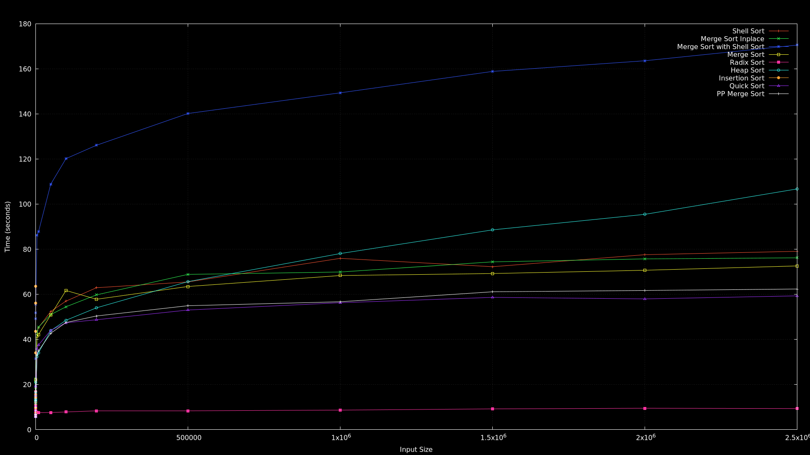

# Sorting Algorithms
Collection of small sorting algorithms implemented in C, in the `sorting.c` file.

## Sorting Algorithms

| Algorithm                 | Average Case | Worst Case   | Stable | In-Place | LOC |
|---------------------------|--------------|-------------------|--------|----------|-----|
| **Shell Sort**            | O(n log n)   | O(n²)        | No     | Yes      | 6   |
| **Merge Sort (InPlace)**  | O(n log n)   | O(n log² n)  | Yes    | Yes      | 18  |
| **Merge Sort with Shell** | O(n log² n)  | O(n² log n)  | No     | Yes      | 7   |
| **Merge Sort**            | O(n log n)   | O(n log n)   | Yes    | No       | 14  |
| **Radix Sort**            | O(nk)        | O(nk)        | Yes    | No       | 11**|
| **Heap Sort**             | O(n log n)   | O(n log n)   | No     | Yes      | 12  |
| **Insertion Sort**        | O(n²)        | O(n²)        | Yes    | Yes      | 5   |
| **Quick Sort**            | O(n log n)   | O(n²)        | No     | Yes      | 6*  |
| **PP Merge Sort**         | O(n log n)   | O(n log n)   | Yes    | No       | 20* |

\* Uses another sort for the base case, to reduce recursion depth, and it makes a huge difference

\*\* Calls insertion sort for very small arrays, and it makes that specific case better

## Description

- **Shell Sort**: An implementation of shell sort using a factor of 8 on gap size, because it seemed to work well for random data.
- **Merge Sort (InPlace)**: In-Place Merge Sort using a stable merger. The only option in here which is both stable, in place and logarithmic in time.
- **Merge Sort with Shell Sort**: In-Place Merge Sort using a Shell Sort as a merger. Ends up being worse than Shell Sort.
- **Merge  Sort**: A bottom up, iterative, ping pong merge sort. Is short, scores well, won't surprise you with worst case time complexities.
- **Radix Sort**: Unbeatable, linear sort, if you have a way of turning your data into radixes. For floats, for example, flip all bits if the sign bit is set, and set the sign bit if it is unset.
- **Heap Sort**: Has a bad constant, so the line is steeper than the others. It's good up to a few million elements.
- **Insertion Sort**: Good base case for other algorithms, fast up to 64 or so, and also the shortest algorithm. Not very good other than that, it doesn't show on the benchmark because it explodes in time.
- **Quick Sort**: A quick quick sort, uses a random pivot and shell sort as base.
- **PP Merge Sort**: An implementation of a top down Ping Pong Merge Sort. It uses insertion sort for the base case, and the same merge function from the iterative merge sort.

